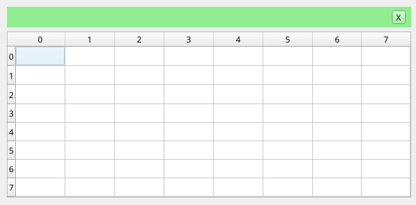

# Simple Spreadsheet Project
Simple spreadsheet project using Qt

## Usage

- Spreadsheet size (row and columns) is chosen from the command line
- Inserting numeric values is straightforward
- Mathematical function have the following syntax: `=functionName(startRow:endRow,startColumn:endColumn)`, for example: `=sum(0:1,7:2)`
- Note: function names are case-insensitive

### Currently implemented mathematical functions
- Max
- Mean
- Min
- Sum

## Requirements
### Build
- CMake >= 3.16
- C++11 compatible compiler
- Qt6 dev
### Run
Qt6 lib (Qt6:Widgets module)
